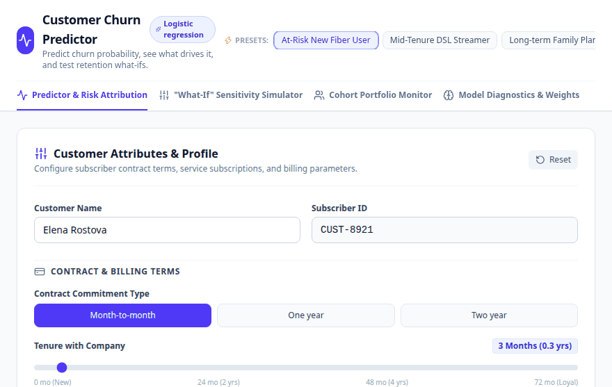
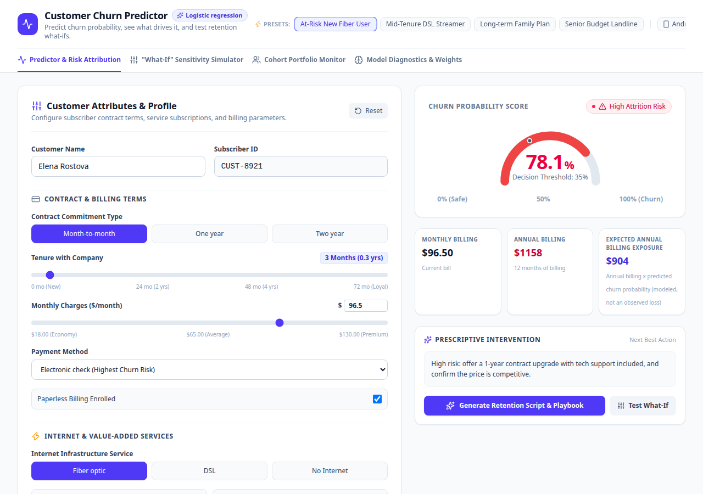
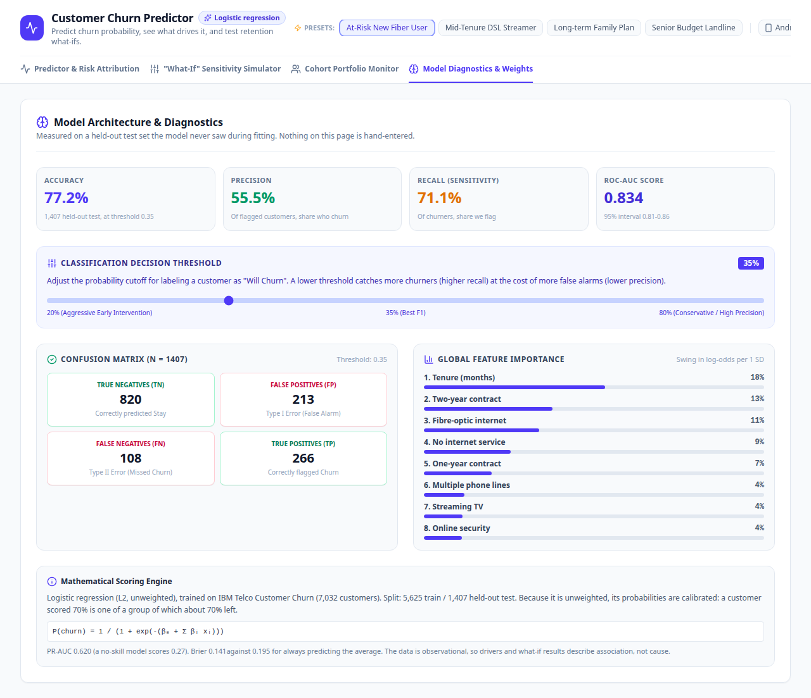

# Customer Churn Predictor

[](https://github.com/jayraj0975/churnapp/actions/workflows/ci.yml)

**Live demo: https://customer-churn-predictor-sr-45ad.vercel.app**

An interactive app that scores how likely a telecom customer is to leave, shows which factors
push that score up or down, and lets you test retention what-ifs. Built with React, TypeScript
and Express, and installable as a PWA.

The model behind it is **trained, not hand-tuned**: a logistic regression on IBM's public Telco
Customer Churn data, evaluated on a held-out test set. The training and analysis live in the
companion repo, [`customer-churn-analysis`](https://github.com/jayraj0975/customer-churn-analysis); this repo carries a
self-contained training script so the app can be regenerated on its own.





## Live demo

The demo is deployed as a **static site**: the model runs in the browser, so predictions, factor contributions, what-if
simulations, the portfolio view and the diagnostics all work with no server. The one thing it does not have is the optional
Gemini-written outreach text, which needs a server-side API key, so retention plans on the demo come from the deterministic
playbook (the screen labels which kind it is). Run it locally with a key to get the Gemini wording.

## The model, honestly

| | |
|---|---|
| Algorithm | Logistic regression, L2, **unweighted** |
| Data | IBM Telco Customer Churn, 7,032 customers (26.6% churn) |
| Split | 5,625 train / 1,407 held-out test, stratified, seed 42 |
| ROC-AUC (test) | **0.834**, 95% bootstrap interval 0.811 to 0.856 |
| PR-AUC (test) | 0.620 (a no-skill model scores 0.27) |
| Brier score | 0.141, against 0.195 for always predicting the average |
| At the 0.35 cut-off (best F1) | precision 56%, recall 71%, accuracy 77% |
| At the 0.50 cut-off | precision 64%, recall 57%, accuracy 80% |

- **Why unweighted?** It keeps the probabilities calibrated. Across the five equal-sized bands of
  the test set, predicted and observed churn rates agree to within a few points (for example
  0.67 predicted against 0.65 observed in the top band),
  so "70%" means about 70 in 100 similar customers left. A test enforces this.
- **Why so few "wow" numbers?** Churn on this dataset is a moderately hard problem. Earlier versions
  of this app displayed a 0.894 AUC and 86% accuracy that came from no model at all; they have been
  replaced by the measured figures above.
- **No lifetime-value figure.** The data has no revenue history, so the app shows annual billing and
  the probability-weighted share of it, and calls it that.



## How the engine works

`scripts/train_model.py` fits the model and writes `src/lib/model.json` (coefficients in raw units,
test metrics at each threshold, calibration bands, and eight real customers with scikit-learn's own
predictions). `src/lib/churnEngine.ts` then scores with
`sigmoid(intercept + sum(coefficient x value))`, with no Python at runtime. `tests/engine.test.ts`
checks the TypeScript predictions against scikit-learn's **to 1e-9**.

- **Drivers.** Each factor's contribution is its coefficient times how far the customer is from the
  dataset average, shown in percentage points of predicted churn.
- **What-if.** Re-scores the customer with a change applied. This is the model's counterfactual, **not**
  a causal estimate: the data is observational.
- **Retention plan.** The server re-scores the customer itself and passes the model's own what-if
  numbers to Gemini, which only writes the wording. Without an API key, a deterministic plan built
  from the same numbers is returned.
- **Inputs are validated** on every endpoint (types, ranges, allowed values) and bodies are size-limited.

## Run it

```bash
npm install
npm run dev            # http://localhost:3000
npm test               # engine and validation tests
npm run check          # typecheck + tests
npm run build && npm start
```

Optional, for AI-written outreach text: copy `.env.example` to `.env` and set `GEMINI_API_KEY`.
To regenerate the model (needs Python with pandas and scikit-learn): `npm run train-model`.

| Endpoint | Purpose |
|---|---|
| `POST /api/predict` | score one customer profile |
| `POST /api/simulate-what-if` | score a profile with adjustments applied |
| `POST /api/retention-strategy` | retention plan for a profile |
| `GET /api/metrics` | measured model metrics |
| `GET /api/health` | liveness |

## Limitations

- Trained on a public teaching dataset; it will not transfer to another operator without retraining.
- The data has no dates, so the split is random rather than temporal.
- Drivers and what-ifs describe association, not cause.
- The example customers in the app are synthetic.

## License

MIT
